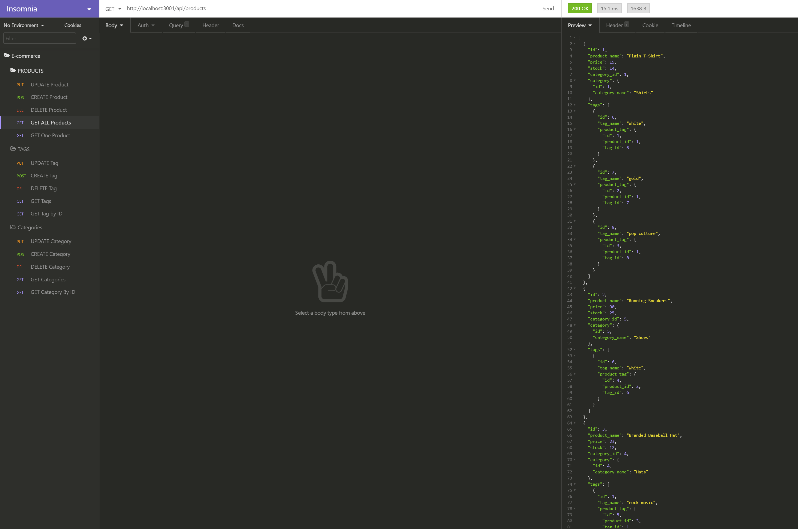

# E-commerce Back End

## Description 
An Express.js driven application that uses Sequelize in order to interact with a MySQL database.

## Table of Contents
* [Installation](#installation) 
* [Usage](#usage) 
* [License](#license) 
* [Contributing](#contributing)
* [Questions](#questions)

 
### Installation
Clone or fork the code from the E-commerce Back End repository on GitHub. Open the code in a standard code editing application, such as VS Code. Be sure to have MySQL, express, sequelize, and dotenv installed from the terminal.
### Usage
Use the integrated terminal in your preferred code-editing application to enter in the command "node index.js". Use an API REST client application such as Insomnia Core to interact with the database. You will also need to create a    .env file referencing the database name and your username and password. 
### Demonstration Video
https://drive.google.com/file/d/1yUpHDXCGT2EVVq1jSGxUAL2zkJlbhl1n/view

### Contributing
This E-commerce Back End is an open source project, and anyone is encourged to contribute by cloning or forking the code and working to improve its function and versatility.

### Questions
    
##### Interested in other projects from this developer? Visit the following GitHub profile:
https://github.com/mplumer
    
##### Send any questions to the following email address:
maxplumer12@gmail.com